# Safe-Sawar

**A women-safety focused carpooling app with biometric verification, SOS alerts, mesh networking, and trusted circles. Built with React Native & TypeScript.**

Safe-Sawar enables women to safely book and share rides through trusted institution-based community circles, with biometric identity verification and an offline-capable Emergency SOS system built on mesh networking.

The app was originally built to tackle rising fuel costs driven by worldwide economic fuel inflation — giving people a safe, trusted way to share rides and split costs. The women-first approach was chosen to directly address safety concerns that prevent women from using conventional carpooling platforms in Pakistan.

As the platform grew, we embedded a dedicated male section to further enhance the overall experience for the wider userbase, while keeping the women-first safety model intact.

> *Travel Together. Stay Safe.*

> **Status:** Currently in prototype / beta testing stage. Additional features are being integrated and tested. Public launch coming soon.
>
> **NADRA Integration:** Actively in talks with NADRA to bring live biometric verification to the platform — making identity checks fully authentic at scale.

---

## Features

### Safety & Verification
- **NADRA Biometric Verification** — Multi-step: CNIC → face scan → OTP via Nishan Pakistan / Shufti Pro / Face++ / Twilio
- **Trust Circles** — Institution-based communities (universities, hospitals, workplaces). Join circles to access verified riders nearby
- **Vouch System** — Vouch for people you know using Trust Credits (5 to start, earn more by completing rides)
- **Emergency SOS** — One-tap alert sent to emergency contacts. Falls back to Bluetooth/WiFi mesh network when offline

### Rides
- **Dual roles** — Passengers book rides; Carpoolers offer rides and track earnings
- **Live ride tracking** — Real-time animated driver location on map
- **Ride matching** — Matched from verified drivers within your circles
- **Location search** — Powered by Nominatim (OpenStreetMap), no API key required

### Platform
- **Gender-specific experience** — Separate female (pink) and male (blue) themes and dashboards
- **Light/dark mode** — Persistent per-user preference
- **Offline SOS** — Mesh relay via Bluetooth/WiFi Direct, up to 10 hops

---

## Tech Stack

| Layer | Technology |
|---|---|
| Framework | Expo SDK 54 + React Native 0.81 |
| Language | TypeScript |
| Navigation | React Navigation 7 (Stack + Bottom Tabs) |
| Maps | react-native-maps |
| Biometrics | expo-local-authentication, expo-camera |
| Location | expo-location |
| Animations | React Native Reanimated 3 + expo-haptics |
| State | React Context + useReducer + AsyncStorage |
| Backend (planned) | Firebase Auth + Firestore |
| Geocoding | Nominatim (OpenStreetMap) |

---

## Getting Started

### Prerequisites
- Node.js 18+
- Expo CLI: `npm install -g expo-cli`
- [Expo Go](https://expo.dev/go) on your phone (iOS or Android)

### Install & Run

```bash
git clone https://github.com/TheHydraBytes/Safe-Sawar.git
cd Safe-Sawar
npm install
npx expo start
```

Scan the QR code with Expo Go on your phone.

```bash
npm run android   # Android emulator
npm run ios       # iOS simulator (macOS only)
npm run web       # Browser
```

---

## Environment Variables

All verification APIs are **simulated by default** — the app runs fully without any keys. To enable real verification, copy `.env.example` to `.env` and fill in the keys:

```env
# NADRA provider: shufti (sandbox) or nishan (official, requires SECP registration)
EXPO_PUBLIC_NADRA_PROVIDER=shufti

# Shufti Pro — free sandbox at shuftipro.com
EXPO_PUBLIC_SHUFTI_CLIENT_ID=
EXPO_PUBLIC_SHUFTI_SECRET_KEY=

# Nishan Pakistan (official NADRA)
EXPO_PUBLIC_NISHAN_CLIENT_ID=
EXPO_PUBLIC_NISHAN_CLIENT_SECRET=

# Twilio OTP
EXPO_PUBLIC_TWILIO_ACCOUNT_SID=
EXPO_PUBLIC_TWILIO_AUTH_TOKEN=
EXPO_PUBLIC_TWILIO_VERIFY_SID=

# Face++ (gender detection)
EXPO_PUBLIC_FACEPP_API_KEY=
EXPO_PUBLIC_FACEPP_API_SECRET=
```

---

## Demo Flow

1. **Splash** — auto-advances after 3s
2. **Onboarding** — 3-slide intro (Safety / Circles / SOS)
3. **Gender Selection** — Female or Male
4. **Auth** — Register or Login
5. **Role Selection** — Passenger or Carpooler
6. **Registration** — Personal / vehicle details
7. **Biometric Verification**:
   - CNIC: `35202-1234567-8` (any `XXXXX-XXXXXXX-X` format works)
   - OTP: `123456`
8. **Home Dashboard** — Browse circles, schedule a ride, activate SOS
9. **Schedule Ride** — Enter pickup/dropoff → matched with a verified driver
10. **Ride In Progress** — Live map, share location, SOS ready

---

## Emergency SOS Architecture

```
Press SOS
  ├── Internet available → alert sent directly to emergency contacts
  └── No internet → activate mesh network
        ├── scan nearby Safe-Sawar devices (Bluetooth / WiFi Direct)
        ├── relay SOS hop-by-hop (TTL: 10 hops)
        └── reaches internet-connected peer → alert delivered
```

---

## Project Structure

```
src/
├── navigation/       # Stack + tab navigator (auth flow + role-based tabs)
├── screens/          # 17 screens across passenger and carpooler roles
├── components/       # SOSButton, BiometricScanner, RideMatchCard, CircleCard, MeshNetworkStatus
├── services/         # biometricService, rideMatchingService, meshNetworkService, circlesService
├── store/            # AppContext + useReducer (auth, rides, circles, SOS, theme)
└── theme/            # Colors (female/male + light/dark palettes), ThemeContext
```

---

## Screenshots

### Onboarding

| Splash | Safety First | Institution Circles | Emergency SOS |
|:---:|:---:|:---:|:---:|
| 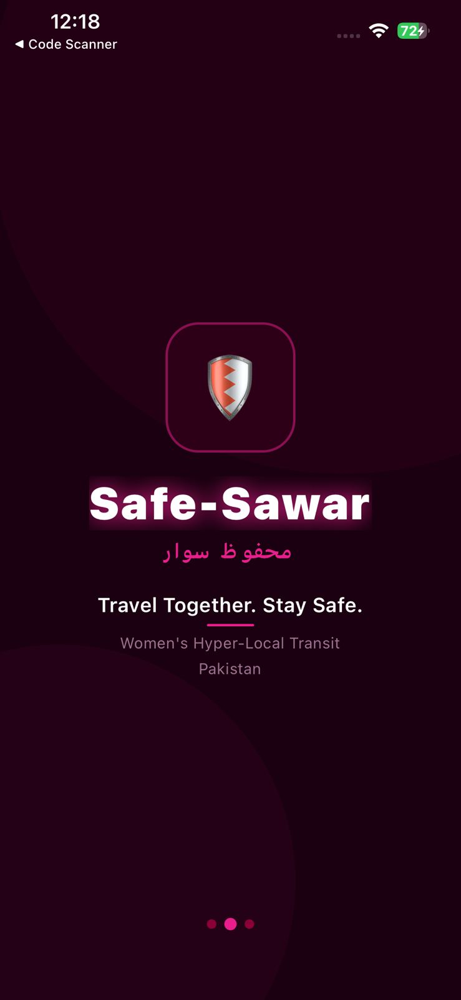 | 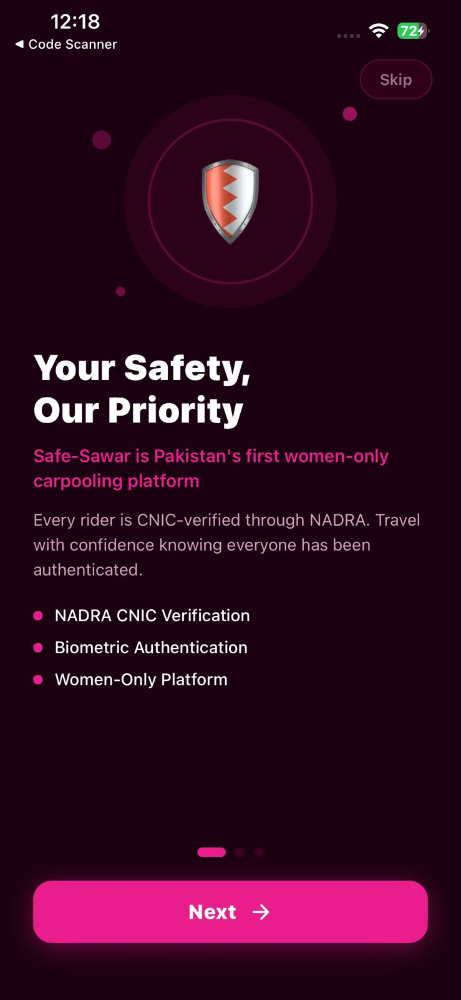 | 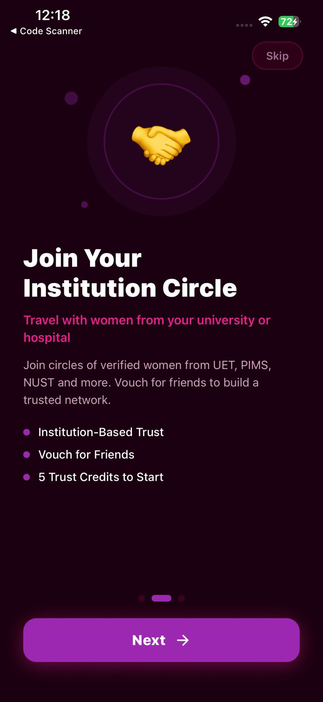 | 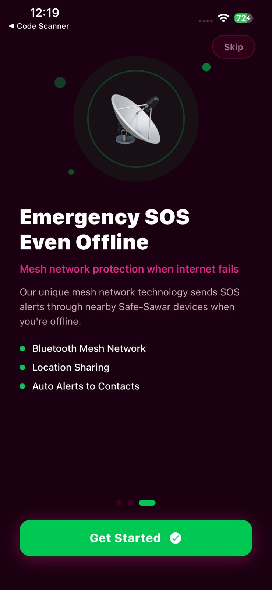 |

### Gender & Auth

| Gender Selection (Android) | Male Auth Screen (Android) |
|:---:|:---:|
| 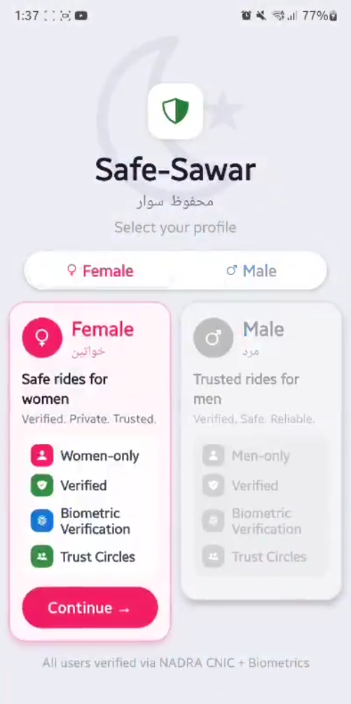 | 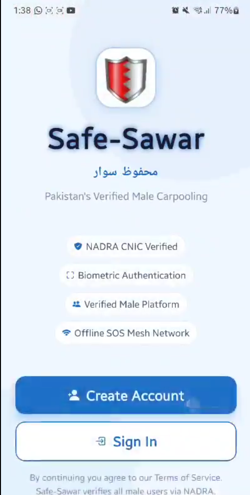 |

### Core App

| Home Dashboard | Institution Vaults | Schedule a Ride | Vouch for Friends |
|:---:|:---:|:---:|:---:|
| 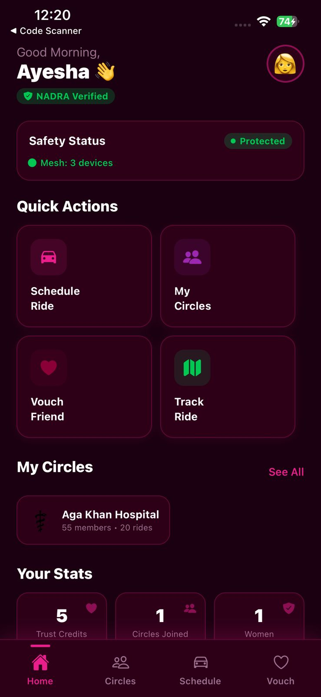 | 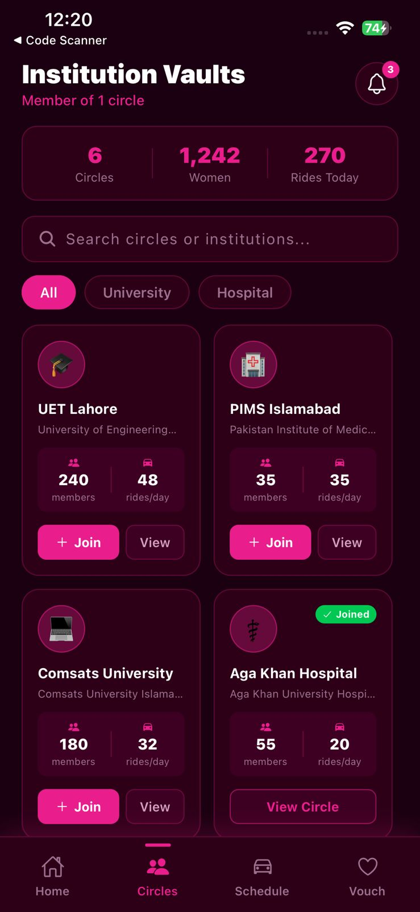 | 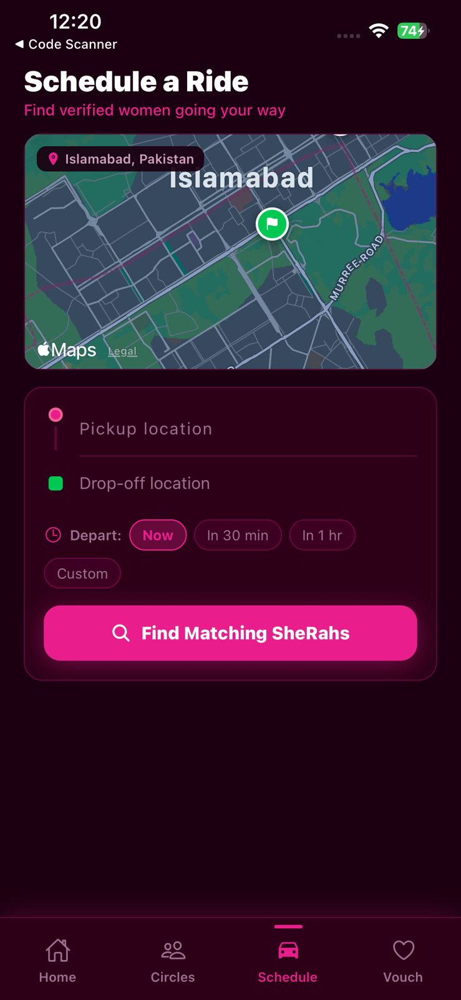 | 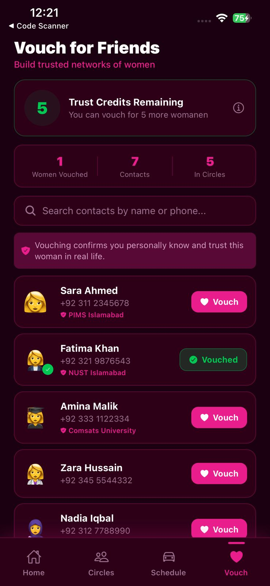 |

### Identity Verification

| NADRA CNIC Verification |
|:---:|
| 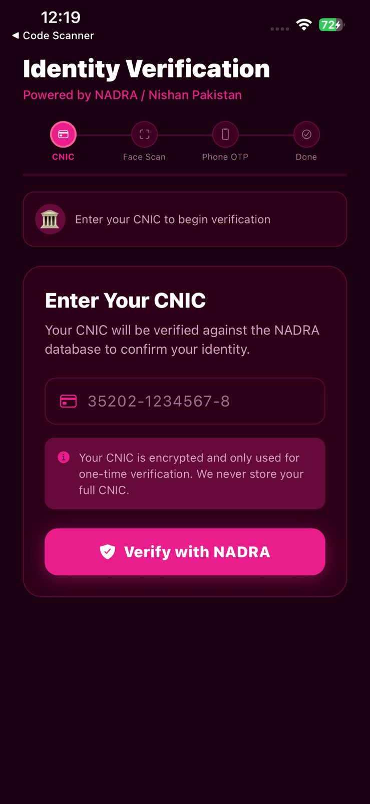 |

---

## Pre-loaded Demo Data

**Circles:** UET Lahore, NUST Islamabad, COMSATS, PIMS Islamabad, Quaid-i-Azam University, Aga Khan Hospital

**Test CNICs:**

| CNIC | Name | City |
|---|---|---|
| `35202-1234567-8` | Ayesha Mahmood | Islamabad |
| `37405-9876543-2` | Fatima Zahra | Lahore |
| `61101-5554443-3` | Sara Ali Khan | Karachi |

---

## Notes

- NADRA verification is **currently simulated** — live integration is in progress with NADRA and will be activated once approved
- Mesh network SOS is **simulated** — production build will use Bluetooth LE / WiFi Direct
- OTP demo code is always `123456`
- Maps use a custom dark style via react-native-maps

---

Built by [HydraBytes](https://www.hydrabytes.tech) — Next-gen digital solutions from Pakistan.
